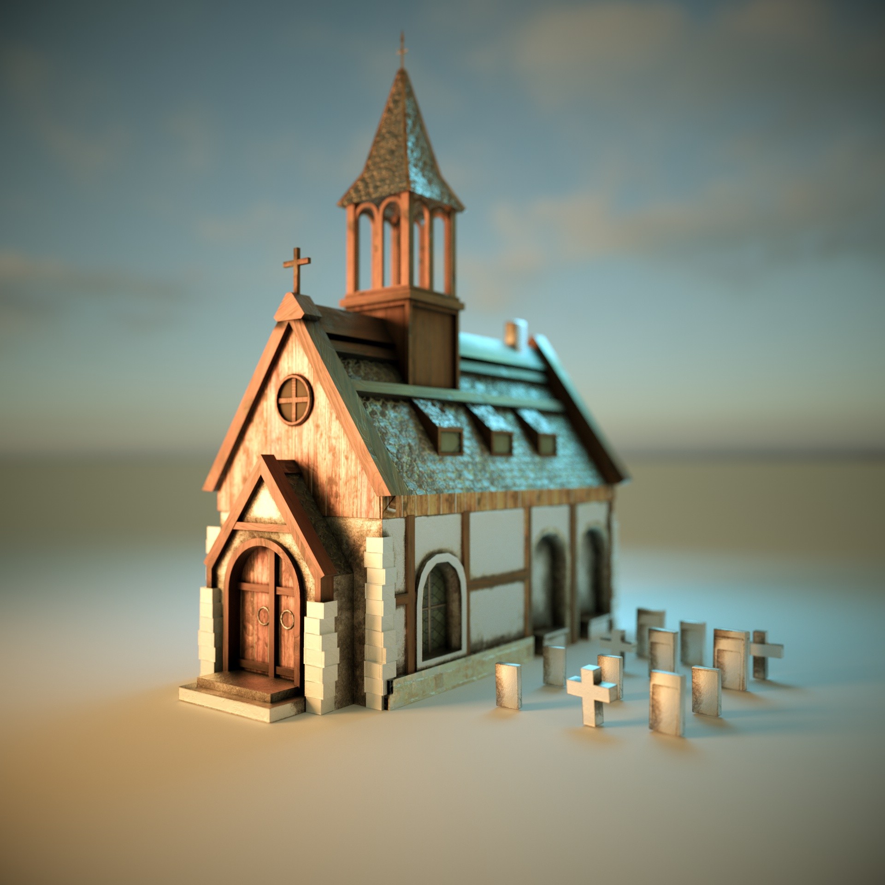

### Die Geschichte der Fastnacht 
##### Eine interaktive Multiscreen-Tischsimulation 

- Projektbeschreibung
- Zielsetzung
- Thematische Schwerpunkte
- Projektentwicklung
- Verwendete Programme/Plugins
- Skizzen/Entwürfe
- 3D Content-Erstellung
- Texturierung
- Contenterstellung
- Installation und Benutzung

### Kurzbeschreibung 

Die interaktive Multiscreen-Tischsimulation wurde für eine Ausstellungsinsel im Fastnachtsmuseum Schloss Langenstein realisiert. Diese Anwendung lässt den Nutzer über eine räumliche Topdown-Ansicht auf die eine mittelalterliche Stadt während der Fastnacht schauen. Die Anwendung ist für die spätere Verwendung im Museum vorgesehen, kann allerdings auch außerhalb des Museums getestet werden. Die Projektdateien und die eigentliche Anwendung werden frei verfügbar sein.

### Förderhinweis

Diese Multiscreen-Anwendung ist entstanden im Verbundprojekt museum4punkt0 - Digitale Strategien für das Museum der Zukunft, Teilprojekt “Kulturgut Fastnacht digital”. Weitere Informationen: [www.museum4punkt0.de](https://www.museum4punkt0.de "www.museum4punkt0.de")

Das Projekt museum4punkt0 wird gefördert durch die Beauftragte der Bundesregierung für Kultur und Medien aufgrund eines Beschlusses des Deutschen Bundestages.

### Zielsetzung/Konzept

Mit Modul 5 setzt das Fasnachtsmuseum Schloss Langenstein mit einer Interaktiven, multi-User-fähigen Tisch-Inszenierung auf ein starkes Storytelling im Bereich Geschichtsvermittlung durch 3D-Animationen.

Ziel ist es, den Ursprung und die historische Entwicklung der Fasnachtsbräuche interaktiv erlebbar zu machen. Auf einem Tisch wird durch Animationen, Licht und Sound ein Festgelage zum Leben erweckt, das die Basis einer Erzählung bildet und den historischen Zusammenhang zwischen Fasnachts- und Fastenzeit vermittelt. Dabei kann die Geschichte von Besucher*innen über eine Multittouchanwendung beeinflusst werden. Das detailgetreue, lebendige Geschehen auf dem Tisch soll Besucher*innen einen niederschwelligen Zugang zur Informationsebene ermöglichen. Lerninhalte sollen abwechslungsreich und emotional gestaltet werden, um dadurch die Vermittlung intensiver erlebbar zu machen. Vorrangig ist die Tisch-Inszenierung an eine digital interessierte und primär nicht museumsaffine Zielgruppe gerichtet.

Die Wissensvermittlung durch 3D-Animationen in Verbindung mit interaktiven Echtzeit-Manipulationen der Grafiken lassen sich auch auf andere Themenbereiche und somit auch auf andere Museen übertragen. Im Entstehungsprozess wird angestrebt verschiedene Entwicklungsumgebungen zur interaktiven Echtzeit-Generierung und Echtzeit-Manipulation von 3D-Grafik zu prüfen, Vor- und Nachteile zu dokumentieren und eine Touch-Applikation zu entwickeln, die nach dem Open-Source-Prinzip auf GitHub veröffentlicht wird. Alle Forschungsergebnisse werden während des Prozesses dokumentiert und können anderen Häusern zur Verfügung gestellt werden.

Die Besucher haben die Möglichkeit von zwei Seiten aus die Szene zu entdecken.
Die Anwendung läuft in Echtzeit und kann mittels zweier Touchscreens interaktiv beeinflusst werden.

### Thematische Schwerpunkte
(Thematischen Schwerpunkt und Verbindung zu Bosch und Brueghel, surrealistische Elemente anreißen.)

(BILD)
Thematisch und stilistisch wird sich an der reichhaltigen Bilderwelt Pieter Brueghels des Älteren orientiert. Aber auch dessen geistiger Vorfahre Hieronymus Bosch beeinflusst diese Inszenierung stark.

(BILD)
Objekte und Figuren aus deren Werken finden sich an vielen Stellen der Anwendung.

### Projektentwicklung 

Die Anwendung wurde in der Unreal Engine 5 entwickelt.
Diese Engine ist frei verfügbar und hier erhältlich: [www.unrealengine.com](www.unrealengine.com "www.unrealengine.com")

Einige Assets wie zb Felsen oder Bodentexturen stammten aus Megascans. 
Die gesamte Megascans Bibliothek ist kostenlos für Nutzer der Unreal Engine nutzbar. [Quixel Megascans](https://quixel.com/megascans/home/ "Quixel Megascans")

Hilfreiche Internetforen während der Realisierung: 
[Unrealengine.de](https://unrealengine.de/ "Unrealengine.de")
[Der Sky - Discord](https://discord.com/invite/YthMfZz "Der Sky - Discord")

##### Verwendete Programme/Plugins

Neben der Unreal Engine 5 als Zielanwendung wurden folgende Programme/Plugins
zur Erstellung des Contents verwendet:

## Beispiel für das Einbinden von Bildern

