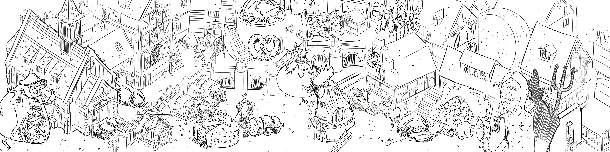

### Die Geschichte der Fastnacht 
##### Eine interaktive Multiscreen-Tischsimulation 

* [Kurzbeschreibung](#Kurzbeschreibung) 
* [Förderhinweis](#Förderhinweis)
* [Zielsetzung-Konzept](#Zielsetzung-Konzept)
* [Themenschwerpunkte](#Themenschwerpunkte)
* [Projektentwicklung](#Projektentwicklung)
* [Verwendete Programme & Plugins](#Verwendete Programme & Plugins)
* [Skizzen-Entwürfe](#Skizzen-Entwürfe)
* [3D-Contenterstellung](#3D-Contenterstellung)
* [Texturierung](#Texturierung)
* [Installation & Benutzung](#Installation & Benutzung)
* [Credits](#Credits) 
* [Lizenz](#Lizenz)

### Kurzbeschreibung 

Die interaktive Multiscreen-Tischsimulation wurde für eine Ausstellungsinsel im Fastnachtsmuseum Schloss Langenstein realisiert. Diese Anwendung lässt den Nutzer über eine räumliche Topdown-Ansicht auf die eine mittelalterliche Stadt während der Fastnacht schauen. Die Anwendung ist für die spätere Verwendung im Museum vorgesehen, kann allerdings auch außerhalb des Museums getestet werden. Die Projektdateien und die eigentliche Anwendung werden frei verfügbar sein.

### Förderhinweis

Diese Multiscreen-Anwendung ist entstanden im Verbundprojekt museum4punkt0 - Digitale Strategien für das Museum der Zukunft, Teilprojekt “Kulturgut Fastnacht digital”. Weitere Informationen: [www.museum4punkt0.de](https://www.museum4punkt0.de "www.museum4punkt0.de")

Das Projekt museum4punkt0 wird gefördert durch die Beauftragte der Bundesregierung für Kultur und Medien aufgrund eines Beschlusses des Deutschen Bundestages.

### Zielsetzung-Konzept

Mit Modul 5 setzt das Fasnachtsmuseum Schloss Langenstein mit einer Interaktiven, multi-User-fähigen Tisch-Inszenierung auf ein starkes Storytelling im Bereich Geschichtsvermittlung durch 3D-Animationen.

Ziel ist es, den Ursprung und die historische Entwicklung der Fasnachtsbräuche interaktiv erlebbar zu machen. Auf einem Tisch wird durch Animationen, Licht und Sound ein Festgelage zum Leben erweckt, das die Basis einer Erzählung bildet und den historischen Zusammenhang zwischen Fasnachts- und Fastenzeit vermittelt. Dabei kann die Geschichte von Besucher*innen über eine Multittouchanwendung beeinflusst werden. Das detailgetreue, lebendige Geschehen auf dem Tisch soll Besucher*innen einen niederschwelligen Zugang zur Informationsebene ermöglichen. Lerninhalte sollen abwechslungsreich und emotional gestaltet werden, um dadurch die Vermittlung intensiver erlebbar zu machen. Vorrangig ist die Tisch-Inszenierung an eine digital interessierte und primär nicht museumsaffine Zielgruppe gerichtet.

Die Wissensvermittlung durch 3D-Animationen in Verbindung mit interaktiven Echtzeit-Manipulationen der Grafiken lassen sich auch auf andere Themenbereiche und somit auch auf andere Museen übertragen. Im Entstehungsprozess wird angestrebt verschiedene Entwicklungsumgebungen zur interaktiven Echtzeit-Generierung und Echtzeit-Manipulation von 3D-Grafik zu prüfen, Vor- und Nachteile zu dokumentieren und eine Touch-Applikation zu entwickeln, die nach dem Open-Source-Prinzip auf GitHub veröffentlicht wird. Alle Forschungsergebnisse werden während des Prozesses dokumentiert und können anderen Häusern zur Verfügung gestellt werden.

Die Besucher haben die Möglichkeit von zwei Seiten aus die Szene zu entdecken.
Die Anwendung läuft in Echtzeit und kann mittels zweier Touchscreens interaktiv beeinflusst werden.

### Themenschwerpunkte
(Thematischen Schwerpunkt und Verbindung zu Bosch und Brueghel, surrealistische Elemente anreißen.)

Thematisch und stilistisch wird sich an der reichhaltigen Bilderwelt Pieter Brueghels des Älteren orientiert. Aber auch dessen geistiger Vorfahre Hieronymus Bosch beeinflusst diese Inszenierung stark.

Objekte und Figuren aus deren Werken finden sich an vielen Stellen der Anwendung.

### Projektentwicklung 

Die Anwendung wurde in der Unreal Engine 5 entwickelt.
Diese Engine ist frei verfügbar und hier erhältlich: 
[www.unrealengine.com](www.unrealengine.com "www.unrealengine.com")

Einige Assets wie zb Felsen oder Bodentexturen stammten aus Megascans. 
Die gesamte Megascans Bibliothek ist kostenlos für Nutzer der Unreal Engine nutzbar. 
[Quixel Megascans](https://quixel.com/megascans/home/ "Quixel Megascans")

Hilfreiche Internetforen während der Realisierung: 
- [Unrealengine.de](https://unrealengine.de/ "Unrealengine.de")
- [Der Sky - Discord](https://discord.com/invite/YthMfZz "Der Sky - Discord")

#### Verwendete Programme & Plugins

Neben der Unreal Engine 5 als Zielanwendung wurden folgende Programme/Plugins
zur Erstellung des Contents verwendet:

- [Cinema 4D](https://www.maxon.net/de/ "Cinema 4D")
- [Substance Painter](https://www.adobe.com/de/products/substance3d-painter.html "Substance Painter")
- [RizomUV](https://www.rizom-lab.com "RizomUV")
- [ZBrush](https://pixologic.com/ "ZBrush")
- [Stack N Pack](https://phillipjenne.gumroad.com/l/StackNPack "Stack N Pack")
- [Character Creator 3](https://www.reallusion.com/de/character-creator/?gclid=CjwKCAjwsJ6TBhAIEiwAfl4TWPX4kH7VNDhAMx83y3D23cRHeMSk9rVOC55vVSV3JCe_956vhRGwLRoCqQgQAvD_BwE "Character Creator 3")
- [Mixamo](https://www.mixamo.com/#/ "Mixamo")

### Skizzen-Entwürfe

Anhand erster Scribbels wurde grob die Themenauswahl festgelegt. Die grundlegenden Themen dieser Inszenierung sind das Schlemmen, die Wollust, der mittelalterliche Narr.

### 3D-Contenterstellung

Sämtliche statischen Modelle entstanden in Cinema 4D. Diese Clayrenderings von Detailansichten dieser mittelalterlichen Welt, ermöglichten bereits früh Eindrücke einer finalen Anwendung zu gewinnen.

Der Aufbau einer komplexen Umgebung lässt es zu, mit verschiedenen Kamera-Blickwinkeln auf unterschiedliche Szenerien und Details des Fastnachtstreibens aufmerksam zu machen.

Für die Komposition der Szenerie dienten zu Beginn des Projektes hilfreiche Blockouts. Hier konnte gut …

### Texturierung

Die für die Texturierung notwendige UV-Abwicklung wurde in RizomUV erledigt. 
Über die sehr praktische Bridge können die Modelle zwischen C4D und RizomUV schnell ausgetauscht werden.

Die Materialien der Modelle wurden anschließend in Adobe Substance Painter erstellt.

Da die Objekte sehr oft mehrere Textursets besaßen, wäre ein manuelles zusammenführen
der im Substance Painter erstellten Materialien in der Unreal Engine sehr zeitaufwendig und unübersichtlich geworden. 

Das Plugin Stack N Pack im Substance Painter ermöglichte es mehrere
Texturesets zusammenzuführen, ohne das Programm verlassen zu müssen.

Mixamo

Die Erstellung der Charaktere im Character Creator 3. Die Kleidung stammt aus dem Reallusion Store: [Medieval Peasant - Mittelalter Kleidung](https://www.reallusion.com/ContentStore/Character-Creator/Pack/3D-Clothing-Medieval-Peasant/default.html "Medieval Peasant - Mittelalter Kleidung") 

Die Charaktere wurden nach der Erstellung im Character Creator 3 in iClone 7 importiert. 
Aus Adobe Mixamo stammende Animationen wurden den Charakteren hinzugefügt und als FBX mit sämtlichen Animationen exportiert. Diese können über die Unreal Engine sehr leicht abgerufen werden. Besitzen die Charaktere dort das gleiche Skeleton (Rig), können die exportierten Animationen unabhängig vom verwendeten Charakter verwendet werden. 

### Unreal Engine 5
#### Installation & Benutzung

Hier wird die Installation der Unreal Engine 5 unter Windows 10 64Bit beschrieben. Unter macOS und Linux sollte die Prozedur identisch sein.

- Systemvorraussetzungen für Windows, macOS, Linux:
https://docs.unrealengine.com/5.0/en-US/hardware-and-software-specifications-for-unreal-engine/

- Um die Unreal Engine 5 zu installieren, muss zuvor der Epic Games Launcher (https://store.epicgames.com/de/download) heruntergeladen werden. Im Launcher kann man sich über diverse Plattform-Accounts wie Google, Facebook, ect anmelden. Es empfiehlt sich hier allerdings ein Epic-Konto zu erstellen, da man darüber innerhalb der Unreal Engine kostenfrei den kompletten Zugang zu Quixel Megascans erhält.
- 
Links im Launcher wird der Reiter Unreal Engine ausgewählt. Über die Reiter oben kommt man zur Bibliothek. Dort lässt sich die aktuelle Version unter ENGINE-VERSIONEN über das Pluszeichen installieren. Es lassen sich sämtliche bisher veröffentlichte Versionen ab Version 4.02 parallel installieren. Der vorgegebene Pfad installiert die Engine auf dem Laufwerk C. Hier sollte ausreichend Speicherplatz zur Verfügung stehen. 500GB sind hier nicht zu viel geschätzt, gerade wenn man häufiger die Engine nutzt. Für den Anfang benötigt man etwa 40GB für die Engine und 20 GB für die Anwendung.
Laden des Projektes

- Das Projekt kann unter diesem Google Drive Link (.....) heruntergeladen werden.
Dieser Link wird in den kommenden Monaten durch einen Link zur Anwendung auf dem Server des Fastnachtsmuseum Schloss Langenstein ersetzt.

- Die heruntergeladenen Dateien können in den Pfad “C:\Users\metul\Documents\Unreal Projects”
verschoben werden. 

- Ist die Unreal Engine installiert, wird sie entweder direkt im Launcher gestartet oder über einen Verknüpfung, die auf dem Desktop automatisch erstellt wurde.

#### Start der Anwendung-Benutzung

Download der Anwendung: https://drive.google.com/drive/folders/1gn_UQMRE60eyXV0dpV1i8ArUPPaRBL4m?usp=sharing

Nach dem Start der Unreal Engine öffnet sich der Unreal Project Browser.
Über den Button “Browse…” lässt sich das Projekt laden. 
Über das Projektverzeichnis kann auch direkt die Datei “FNM_Tisch_01.uproject” gestartet werden.

- Start der Anwendung aus der Unreal Engine 5 heraus
In der Unreal Engine werden beim ersten Start des Projektes alle Shader geladen. Dieser Vorgang kann zeitintensiv sein und hängt stark von den verwendeten Hardwarekomponenten ab.
Sind alle Shader geladen, kann man sich mit den Tasten WASD und der Maus oder einem Spielecontroller frei durch die Szene bewegen. 

Die Anwendung selbst wird über den grünen Play Button gestartet. Rechts daneben kann man über ein Dropdown Menü unter anderem auswählen, ob die Anwendung im Editorfenster, als VR-Anwendung oder zum Beispiel als Standalone Game gestartet werden soll.
Aus der Anwendung kommt man zum derzeitigen Stand über die Escape Taste.

Eine Anleitung, wie aus der Unreal Engine heraus eine lauffähige Standalone-Anwendung erstellt werden kann, die auch auf anderen System funktioniert, findet sich hier:
[Packaging Dokumentation](https://docs.unrealengine.com/4.27/en-US/Basics/Projects/Packaging/)

### Blueprints

Ein Beispiel für den Aufbau eines Blueprints zur interaktiven Steuerung von Objekten.

### nDisplay

nDisplay ermöglicht die Darstellung einer Anwendung über mehrer Displays. 
Es handelt sich dabei um ein Feature, auf welches während der Entwicklung verzichtet werden musste, da dieses in der für das Projekt verwendeten Early Accsess Version der Unreal Engine 5 noch nicht zufriedenstellend integriert war. Da sich dies mit der finalen Version 5.0 geändert hat, ist es nun möglich diese Funktionalität in die Anwendung zu übertragen. Durch nDisplay werden zwei Instanzen der Anwendung auf zwei oder mehr Displays gleichzeitig gestartet. Bezogen auf unser Projekt bedeutet das, dass Aktionen, welche auf Display A ausgeführt werden, Auswirkungen auf die Umgebung auf in Display B haben können, da man sich nach wie vor in der gleichen Anwendung befindet. 
[nDisplay Dokumentation](https://docs.unrealengine.com/4.26/en-US/WorkingWithMedia/nDisplay/)
Für den schnellen Praxis-Einstieg empfielt sich diese Quickstart-Anleitung: 
[nDisplay Quickstart](https://docs.unrealengine.com/5.0/en-US/ndisplay-quick-start-for-unreal-engine/)

### Kontakt

- Anspechpartner Projektsteuerung: Michael Fuchs
- E-Mail: praesident@fasnachtsmuseum.de
- Ansprechpartner Anwendung: Daniel Böhme 
- E-Mail: daniel.boehme.motiondesign@gmx.de
- Ansprechpartner Hardwaretechnik: Christian Becker
- E-Mail: mail@christianbecker.de

### Lizenz

Hiermit wird jeder Person, die eine Kopie dieser Software und der zugehörigen Dokumentationsdateien (die "Software") erhält, kostenlos die Erlaubnis erteilt, uneingeschränkt mit der Software zu handeln, einschließlich und ohne Einschränkung der Rechte zur Nutzung, zum Kopieren, Modifizieren, Zusammenführen, Veröffentlichen, Verteilen, Unterlizenzieren und/oder Verkaufen von Kopien der Software, und Personen, denen die Software zur Verfügung gestellt wird, dies unter den Bedingungen der MIT-Lizenz zu gestatten: Näheres siehe hier in der [Lizenz Datei](https://github.com/museum4punkt0/Die-Geschichte-der-Fastnacht/blob/68d0cf95f8bd61cb5c72ea27e19bc2c9450e0807/LICENSE) 

